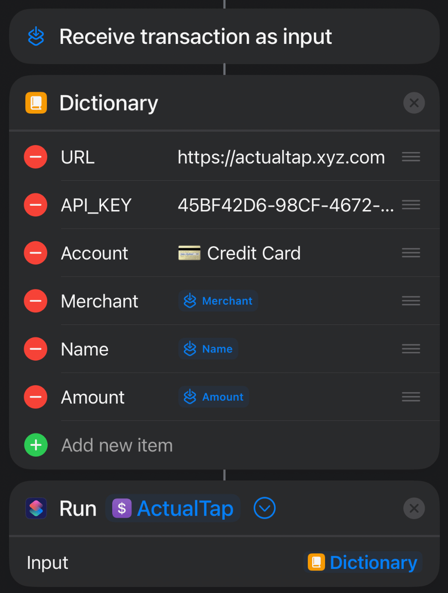

# Actual Tap

<p align="center">
    
    <br>
    <i>Automatically create transactions in <a href="https://github.com/actualbudget/actual">Actual Budget</a> when you use Tap-to-Pay on a mobile device</i>
</p>

## Overview

Actual Tap bridges the gap between mobile payments and your Actual Budget, making expense tracking seamless and automatic. When you tap to pay with your mobile device, Actual Tap receives the transaction details and automatically creates the corresponding entry in your Actual Budget.

## Key Features

- 🚀 Fast and lightweight Fastify API
- 💳 Automatic transaction creation from Tap-to-Pay
- 📱 Mobile automation support (iOS Shortcuts & Android Tasker)
    - [iOS Shortcut](#ios-setup)
- 🔒 Secure API key authentication
- 🐳 Easy deployment with Docker
- 🔄 Real-time transaction syncing with Actual Budget

## How It Works

Actual Tap is a Fastify API that utilizes the Actual Budget API Client to create transactions. Here's the ideal flow:

1. Mobile device is tapped to make a purchase
2. Automation on mobile device is triggered
    - Recommended apps are [Shortcuts](https://apps.apple.com/us/app/shortcuts/id915249334) (iOS) or [Tasker](https://play.google.com/store/apps/details?id=net.dinglisch.android.taskerm) (Android)
3. POST request containing transaction information is sent to Actual Tap
4. Actual Tap creates the transaction in Actual Budget

<p align="center">
    
</p>

## API Request Format

### Headers
```
X-API-KEY: your-api-key
Content-Type: application/json
```

### Request Body
```json
{
  "account": "Checking",  // Required: Name of the account in Actual Budget
  "amount": 10.50,       // Optional: Transaction amount (defaults to 0)
  "payee": "Starbucks"   // Optional: Name of the payee (defaults to "Unknown")
}
```

### Example cURL
```bash
curl -X POST https://actualtap.yourdomain.com/transaction \
  -H "X-API-KEY: your-api-key" \
  -H "Content-Type: application/json" \
  -d '{
    "account": "Checking",
    "amount": 10.50,
    "payee": "Starbucks"
  }'
```

## Setup and Installation

### Running with Docker

#### Docker CLI

```bash
docker run -p 3001:3001 \
  -e TZ=your_timezone \
  -e API_KEY=your_api_key \
  -e ACTUAL_URL=your_actual_url \
  -e ACTUAL_PASSWORD=your_password \
  -e ACTUAL_SYNC_ID=your_budget_id \
  mattyfaz/actualtap
```
#### Docker Compose

```yml
services:
  actualtap:
    container_name: actualtap 
    image: mattyfaz/actualtap:latest
    restart: always
    ports:
      - 3001:3001
    volumes:
      - /your/path/here:/app/data
    environment:
      - TZ=
      - API_KEY=
      - ACTUAL_URL=
      - ACTUAL_PASSWORD=
      - ACTUAL_SYNC_ID=
```

### Environment Variables

| Variable | Example | Description |
|----------|---------|-------------|
| `TZ` | Australia/Melbourne | Your timezone, ideally you should match the TZ set in Actual |
| `API_KEY` | 527D6AAA-B22A-4D48-9DC8-C203139E5531 | Unique API key for authentication (generate with [uuidgenerator.net](https://www.uuidgenerator.net)) |
| `ACTUAL_URL` | https://actual.yourdomain.com | URL to Actual Budget Server |
| `ACTUAL_PASSWORD` | superSecretPassword | Password for your Actual Budget Server |
| `ACTUAL_SYNC_ID` | 8B51B58D-3A0D-4B5B-A41F-DE574306A4F2 | The Unique ID of your Budget |

### Local Development

1. Clone the repository:
   ```bash
   git clone https://github.com/MattFaz/actualtap.git
   cd actualtap
   ```

2. Install dependencies:
   ```bash
   npm install
   ```

3. Set up your environment variables in your terminal:
   ```bash
   export API_KEY="your-api-key"
   export ACTUAL_URL="your-actual-url"
   export ACTUAL_PASSWORD="your-password"
   export ACTUAL_SYNC_ID="your-budget-id"
   ```

4. Start the development server:
   ```bash
   npm run dev
   ```

The app will run on port `3001` by default.

## Mobile Setup

**Note**: Mobile setup requires ActualTap container running and publicly accessible via URL.

### iOS Setup

Setup for iOS has 2 parts, one is a Shortcut, and the second is an Automation to trigger the Shortcut upon tapping your iOS device to pay.

Click the following link to download and add the Shortcut: https://www.icloud.com/shortcuts/a07b4aca380f422ba30e1ccf1ca95aa9

You do not nee to make any edits to the Shortcut. Once added, follow the below steps to create the Automation, end result will look like the screenshot below:



1. Open Shortcuts app, select *'Automations'*, then *'+'* to create a new Automation
2. Tap *'Transaction'* and Enable relevant Card, all Categories, then select *'Run Immediately'*
    - Do **not** enable *'Notify When Run'*
3. Select *'New Blank Automation'*, then Search & add *'Dictionary'*
    - Add the values below to Dictionary:

      | Item | Type | Value |
      | - | - | - |
      | URL |Text|https://actualtap.yourdomain.com|
      | API_KEY |Text|*api_key used when setting up ActualTap*|
      | Account | Text | *exact name of Account in Actual Budget* |
      | Merchant | Text | *Tap 'Select Variable' then tap 'Shortcut Input'. Then Tap 'Shortcut Input' in the Value and change it to Merchant* |
      | Name | Text | *Tap 'Select Variable' then tap 'Shortcut Input'. Then Tap 'Shortcut Input' in the Value and change it to Name* |
      | Amount | Text |  *Tap 'Select Variable' then tap 'Shortcut Input'. Then Tap 'Shortcut Input' in the Value and change it to Amount* |

4. Search & tap on *'Run Shortcut'*
5. Tap *'Shortcut'* and select *'ActualTap'*
6. Tap the *'>'* to expand the action, and change *'Input'* value to *'Dictionary'*

### Android Setup

**Tip:  Rename the card in your Google Wallet to match the account name in Actual Budget.  This will allow you to use the %account variables and use multiple cards with Google Wallet and Actual Budget.**

#### Tasker

This method requires the **Notification** addon for Tasker.

1.  Add "+" a task within Tasker, and proceed to Taskernet.
      - Search for "Wallet to ActualBudget" and import the task.
        - Import by long pressing on "PROFILES"
2. Navigate to the "TASKS" tab and edit "Send To ActualTap"
3. Edit the HTTP Request step
      - Replace URL with http://{your-actual-tap-address.com}/transaction
      - Add your API key to HEADERS
      - Body:
        - Remove the [ ] brackets.

#### Automate by LlammaLabs

The free version of Automate allows 30 blocks to be run at once with full capability.  This flo uses 11 of the 30.


1. Download the flo for Automate. https://llamalab.com/automate/community/flows/50847
    - This can be searched for within the Automate app on your mobile device.
2. Edit the "HTTP request" block
    - Update the Request URL to your actualtap address
    - Update your API key for your actualtap deployment


3. Save your changes and start flo.

**Summary of flo**
  - The flo will pause until a new notification appears.
  - If the notification is Google Wallet, proceed.
  - Set two variables.  One for payee and one that contains account and amount information.
  - Get current date
  - Use a REGEX pattern to extract the amount information.
  - Pass the amount, payee, and date information to actualtap using the HTTP request block.
  - If the httprequest was successful, returns 200, remove the notification.
  - If the httprequest failed, leave the notification and return to wait for a new notification.

If a request failed, you can change the Notification block to activate "Immediately" to process it.  Then change it back to "When transition"

## Caddy

Actual Tap was developed with Mobile Tap-to-Pay as the main use case. In order for that to function Actual Tap needs to be exposed to the internet. Below is a standard Caddyfile configuration:
```
actualtap.yourdomain.com {
    @auth header X-API-KEY your-api-key
    handle @auth {
        reverse_proxy 0.0.0.0:3001
    }
    respond 401
}
```
---

**Note:** This project is in active development. Issues, pull requests, and feature requests are welcome.
