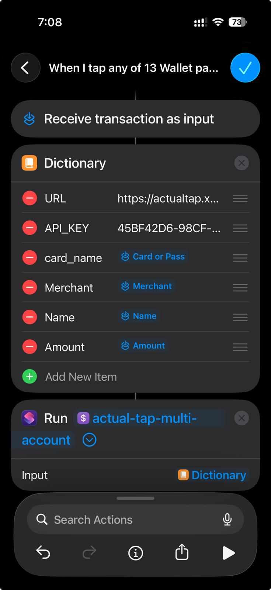

# Actual Tap

<p align="center">
    
    <br>
    <i>Automatically create transactions in <a href="https://github.com/actualbudget/actual">Actual Budget</a> when you use Tap-to-Pay on a mobile device</i>
</p>

## Overview

Actual Tap bridges the gap between mobile payments and your Actual Budget, making expense tracking seamless and automatic. When you tap to pay with your mobile device, Actual Tap receives the transaction details and automatically creates the corresponding entry in your Actual Budget.

## Key Features

- 🚀 Fast and lightweight Fastify API
- 💳 Automatic transaction creation from Tap-to-Pay
- 💳 Multi card support (ios)
- ❓ Fallback account in case the card is wrong/null
- 📱 Mobile automation support (iOS Shortcuts & Android Tasker)
    - [iOS Shortcut](#ios-setup)
- 🔒 Secure API key authentication
- 🐳 Easy deployment with Docker
- 🔄 Real-time transaction syncing with Actual Budget

## How It Works

Actual Tap is a Fastify API that utilizes the Actual Budget API Client to create transactions. Here's the ideal flow:

1. Mobile device is tapped to make a purchase
2. Automation on mobile device is triggered
    - Recommended apps are [Shortcuts](https://apps.apple.com/us/app/shortcuts/id915249334) (iOS) or [Tasker](https://play.google.com/store/apps/details?id=net.dinglisch.android.taskerm) (Android)
3. POST request containing transaction information is sent to Actual Tap
4. Actual Tap creates the transaction in Actual Budget

<p align="center">
    
</p>

## API Request Format

### Headers
```
X-API-KEY: your-api-key
Content-Type: application/json
```

### Request Body
```json
{
  "account": "Checking",  // Required: Name of the account in Actual Budget
  "amount": 10.50,       // Optional: Transaction amount (defaults to 0). If negative then it's a deposit
  "payee": "Starbucks",  // Optional: Name of the payee (defaults to "Unknown")
  "type": "payment"      // Optional: "payment" or "deposit" (defaults to "payment")
}
```

### Example cURL
```bash
# Regular transaction (expense)
curl -X POST https://actualtap.yourdomain.com/transaction \
  -H "X-API-KEY: your-api-key" \
  -H "Content-Type: application/json" \
  -d '{
    "account": "Checking",
    "amount": 10.50,
    "payee": "Starbucks"
  }'

# Deposit transaction
curl -X POST https://actualtap.yourdomain.com/transaction \
  -H "X-API-KEY: your-api-key" \
  -H "Content-Type: application/json" \
  -d '{
    "account": "Checking",
    "amount": 100.00,
    "payee": "Refund",
    "type": "deposit"
  }'
```

## Setup and Installation

**Note:** `ACTUAL_ENCRYPTION_PASSWORD` is optional, it's only required if End-to-end encryption is Enabled on Actual Server and a password has been set.

### Running with Docker

#### Docker CLI

```bash
docker run -p 3001:3001 \
  -e TZ=your_timezone \
  -e API_KEY=your_api_key \
  -e ACTUAL_URL=your_actual_url \
  -e ACTUAL_PASSWORD=your_password \
  -e ACTUAL_SYNC_ID=your_budget_id \
  -e ACTUAL_ENCRYPTION_PASSWORD=your_encryption_password \ # optional
  mattyfaz/actualtap
```
#### Docker Compose

```yml
services:
  actualtap:
    container_name: actualtap
    image: mattyfaz/actualtap:latest
    restart: always
    ports:
      - 3001:3001
    environment:
      - TZ=
      - API_KEY=
      - ACTUAL_URL=
      - ACTUAL_PASSWORD=
      - ACTUAL_SYNC_ID=
      - ACTUAL_ENCRYPTION_PASSWORD=
```

### Environment Variables

| Variable | Example | Description |
|----------|---------|-------------|
| `TZ` | Australia/Melbourne | Your timezone, ideally you should match the TZ set in Actual |
| `API_KEY` | 527D6AAA-B22A-4D48-9DC8-C203139E5531 | Unique API key for authentication (generate with [uuidgenerator.net](https://www.uuidgenerator.net)) |
| `ACTUAL_URL` | https://actual.yourdomain.com | URL to Actual Budget Server |
| `ACTUAL_PASSWORD` | superSecretPassword | Password for your Actual Budget Server |
| `ACTUAL_SYNC_ID` | 8B51B58D-3A0D-4B5B-A41F-DE574306A4F2 | The Unique ID of your Budget |
| `ACTUAL_ENCRYPTION_PASSWORD` | encryptedSecretPassword | Your Encrypted Password *(optional, N/A if not using End-to-end encryption)* |

### Local Development

1. Clone the repository:
   ```bash
   git clone https://github.com/MattFaz/actualtap.git
   cd actualtap
   ```

2. Install dependencies:
   ```bash
   npm install
   ```

3. Set up your environment variables in your terminal:
   ```bash
   export API_KEY="your-api-key"
   export ACTUAL_URL="your-actual-url"
   export ACTUAL_PASSWORD="your-password"
   export ACTUAL_SYNC_ID="your-budget-id"
   export ACTUAL_ENCRYPTION_PASSWORD="encryptedSecretPassword" # optional
   ```

4. Start the development server:
   ```bash
   npm run dev
   ```

The app will run on port `3001` by default.

## Mobile Setup

**Note**: Mobile setup requires ActualTap container running and publicly accessible via URL.

### iOS Setup

Setup for iOS has 2 parts, one is a Shortcut, and the second is an Automation to trigger the Shortcut upon tapping your iOS device to pay.

Click the following link to download and add the Shortcut: https://www.icloud.com/shortcuts/6586d705185c49dab336ffa2945e30fe

The following edits must be made to the shortcut:
- Define the fallback account in the `text` block (see comment inside the shortcut)
- Complete the card-account `dictionary` mapping (see comment inside the shortcut)

Click the following link to download and add the manual test Shortcuts: 
- General one: https://www.icloud.com/shortcuts/a4dd567edc3f4ce19c357d9e7903f16d
- Test with card fallback and weird merchant: https://www.icloud.com/shortcuts/5598a7503c7d475e9dd8467d0469363c


Click the following link to download and the template automation:
- Note that this is a shortcut, but to allow transactions it must be an automation. This shortcut is kept for reference
https://www.icloud.com/shortcuts/3a40112fe5d94a7bbcb840f6e99e36ae 




1. Open Shortcuts app, select *'Automations'*, then *'+'* to create a new Automation
2. Tap *'Wallet'* and Enable relevant Card, all Categories, then select *'Run Immediately'*
    - Do **not** enable *'Notify When Run'*
3. Select *'New Blank Automation'*, then Search & add *'Dictionary'*
    - Add the values below to Dictionary:

      | Item | Type | Value |
      | - | - | - |
      | URL |Text|https://actualtap.yourdomain.com|
      | API_KEY |Text|*api_key used when setting up ActualTap*|
      | Merchant | Text | *Tap 'Select Variable' then tap 'Shortcut Input'. Then Tap 'Shortcut Input' in the Value and change it to Merchant* |
      | Name | Text | *Tap 'Select Variable' then tap 'Shortcut Input'. Then Tap 'Shortcut Input' in the Value and change it to Name* |
      | Amount | Text or Number |  *Tap 'Select Variable' then tap 'Shortcut Input'. Then Tap 'Shortcut Input' in the Value and change it to Amount* |

4. Search & tap on *'Run Shortcut'*
5. Tap *'Shortcut'* and select *'actual-tap-multi-account-template'*
6. Tap the *'>'* to expand the action, and change *'Input'* value to *'Dictionary'*

### Android Setup

**Tip:  Rename the card in your Google Wallet to match the account name in Actual Budget.  This will allow you to use the %account variables and use multiple cards with Google Wallet and Actual Budget.**

#### Tasker

This method requires the **Notification** addon for Tasker.

1.  Add "+" a task within Tasker, and proceed to Taskernet.
      - Search for "Wallet to ActualBudget" and import the task.
        - Import by long pressing on "PROFILES"
2. Navigate to the "TASKS" tab and edit "Send To ActualTap"
3. Edit the HTTP Request step
      - Replace URL with http://{your-actual-tap-address.com}/transaction
      - Add your API key to HEADERS
      - Body:
        - Remove the [ ] brackets.

#### Automate by LlammaLabs

The free version of Automate allows 30 blocks to be run at once with full capability.  This flo uses 11 of the 30.


1. Download the flo for Automate. https://llamalab.com/automate/community/flows/50847
    - This can be searched for within the Automate app on your mobile device.
2. Edit the "HTTP request" block
    - Update the Request URL to your actualtap address
    - Update your API key for your actualtap deployment


3. Save your changes and start flo.

**Summary of flo**
  - The flo will pause until a new notification appears.
  - If the notification is Google Wallet, proceed.
  - Set two variables.  One for payee and one that contains account and amount information.
  - Get current date
  - Use a REGEX pattern to extract the amount information.
  - Pass the amount, payee, and date information to actualtap using the HTTP request block.
  - If the httprequest was successful, returns 200, remove the notification.
  - If the httprequest failed, leave the notification and return to wait for a new notification.

If a request failed, you can change the Notification block to activate "Immediately" to process it.  Then change it back to "When transition"

### Home Assistant

#### ***Enable features in the companion app***

Navigate to **Settings -> Companion App -> Manage Sensors**
Select **Last Notification**
  1. Enable the sensor
  2. Select **Allow list**.  Select any apps that will be used for posting transactions.  **Google Wallet** is typically selected.

#### Edit ***configuration.yaml*** for the Home Assistant server

Add a section in configuration.yaml and update your actualtap url.
```
rest_command:
  actualbudget:
    url: "https://actualtap.example.com/transaction"
    method: post
    content_type: 'application/json'
    headers:
      X-API-KEY: !secret actualtap_api
    payload: '{"account": "{{accountVar}}", "amount": "{{amountVar}}", "date": "{{dateVar}}", "payee": "{{payeeVar}}", "notes": "{{notesVar}}"}'

```

### Edit ***secrets.yaml***

Add your api key.

```
actualtap_api: "YOUR API KEY"
```

### Create an Automation

Navigate to ***Settings -> Automations and Scenes*** within Home Assistant.

Create a new Automation

Use the three dot menu at the top to ***"Edit in YAML"***.

Paste the following code.  Replace ***"your_device"*** with your devices name.

```
alias: Google Wallet Transaction Automation
description: ""
triggers:
  - entity_id: sensor.your_device_last_notification
    trigger: state
actions:
  - data:
      accountVar: >
         
          {{ text.split(' with ')[1] if ' with ' in text else 'Unknown Account' }}
        
          'Unknown Account'
        
      amountVar: >
         
          
          {{ match[0] if match else '0.00' }}
        
          '0.00'
        
      dateVar: "{{ now().date() }}"
      payeeVar: >-
        {{ state_attr('sensor.your_device_last_notification', 'android.title')
        }}
      notesVar: Added with Home Assistant
    response_variable: httpresponse
    action: rest_command.actualbudget
  - data:
      level: info
      message: "REST Response: {{ httpresponse }}"
    action: system_log.write
```


## Caddy

Actual Tap was developed with Mobile Tap-to-Pay as the main use case. In order for that to function Actual Tap needs to be exposed to the internet. Below is a standard Caddyfile configuration:
```
actualtap.yourdomain.com {
    @auth header X-API-KEY your-api-key
    handle @auth {
        reverse_proxy 0.0.0.0:3001
    }
    respond 401
}
```

## Troubleshooting

### Common Errors and Solutions

#### Connection Errors

**Error: `Invalid ACTUAL_URL format`**
- **Cause:** The URL is malformed or uses an invalid protocol
- **Solution:** Ensure `ACTUAL_URL` uses `http://` or `https://` protocol (e.g., `https://actual.yourdomain.com`)

**Error: `Connection timed out - check if server is accessible`**
- **Cause:** Cannot reach the Actual Budget server within 5 seconds
- **Solution:**
  - Verify the server is running and accessible
  - Check network connectivity
  - Verify firewall rules allow the connection

**Error: `Cannot resolve hostname - check if ACTUAL_URL is correct`**
- **Cause:** DNS cannot resolve the hostname
- **Solution:** Verify the URL is correct and the domain exists

**Error: `Connection refused - check if server is running`**
- **Cause:** Server is not accepting connections on the specified port
- **Solution:** Verify Actual Budget server is running and listening on the correct port

**Error: `Server returned HTTP [status code]`**
- **Cause:** Server responded but with an error status
- **Solution:** Check Actual Budget server logs for issues

#### Authentication Errors

**Error: `ACTUAL_PASSWORD is incorrect (no budgets found)`**
- **Cause:** The password provided is invalid
- **Solution:** Verify `ACTUAL_PASSWORD` matches your Actual Budget server password

**Error: `Authentication failed`**
- **Cause:** Cannot authenticate with the provided credentials
- **Solution:**
  - Verify `ACTUAL_PASSWORD` is correct
  - Check Actual Budget server logs for authentication issues

#### Budget Errors

**Error: `Budget '[id]' not found. Available: [list]`**
- **Cause:** The specified `ACTUAL_SYNC_ID` does not exist
- **Solution:**
  - Check the list of available budget IDs in the error message
  - Update `ACTUAL_SYNC_ID` to use one of the available IDs
  - You can find your budget's Sync ID in Actual Budget under Settings → Show advanced settings → Sync ID

**Error: `ACTUAL_ENCRYPTION_PASSWORD is incorrect`**
- **Cause:** The encryption password is wrong or the budget is not encrypted
- **Solution:**
  - If your budget uses end-to-end encryption, verify `ACTUAL_ENCRYPTION_PASSWORD` is correct
  - If your budget is not encrypted, remove the `ACTUAL_ENCRYPTION_PASSWORD` environment variable

**Error: `Failed to download budget`**
- **Cause:** General error downloading the budget
- **Solution:**
  - Check Actual Budget server logs
  - Verify network connectivity
  - Try restarting ActualTap

**Error: `Budget failed to open. This is likely due to a version mismatch...`**
- **Cause:** The Actual Budget server version is newer than the @actual-app/api version bundled with ActualTap
- **Solution:**
  - Update ActualTap to the latest version that matches your Actual Budget server version
  - Check the [releases page](https://github.com/MattFaz/actualtap/releases) for version compatibility

#### Transaction Errors

**Error: `401 Unauthorized`**
- **Cause:** Missing or invalid API key
- **Solution:** Ensure the `X-API-KEY` header matches the `API_KEY` environment variable

**Error: `Account '[name]' not found`**
- **Cause:** The specified account does not exist in your budget
- **Solution:**
  - Verify the account name in your request exactly matches an account in Actual Budget (case-sensitive)
  - Check for extra spaces or typos in the account name

#### Initialization Errors

**Error: `Initialization timed out after 30 seconds`**
- **Cause:** Actual API took too long to initialize
- **Solution:**
  - Check network connectivity to Actual Budget server
  - Verify server is responsive
  - Try restarting ActualTap

### Viewing Logs

ActualTap uses pretty-printed logs for easier troubleshooting. To view logs:

**Docker:**
```bash
docker logs actualtap
```

**Docker Compose:**
```bash
docker compose logs actualtap
```

Logs will show detailed information about the initialization process, including which step failed and why.

---

**Note:** This project is in active development. Issues, pull requests, and feature requests are welcome.
